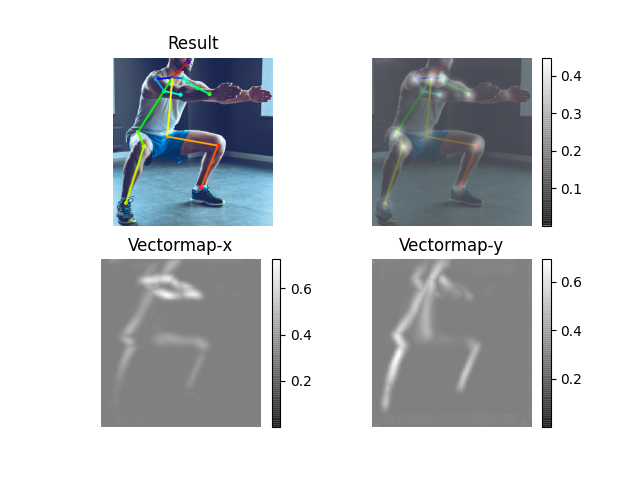
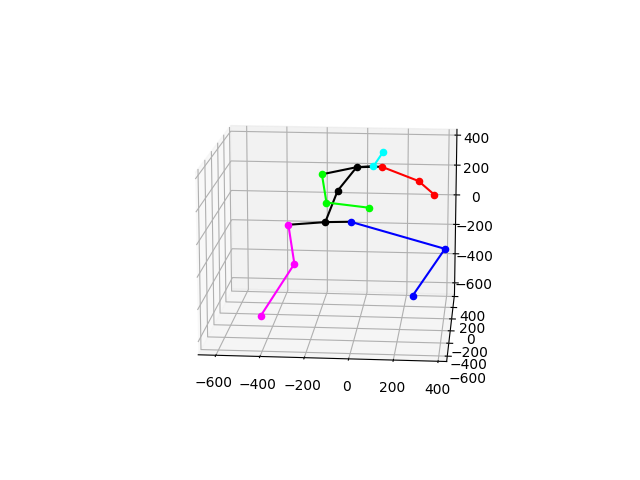
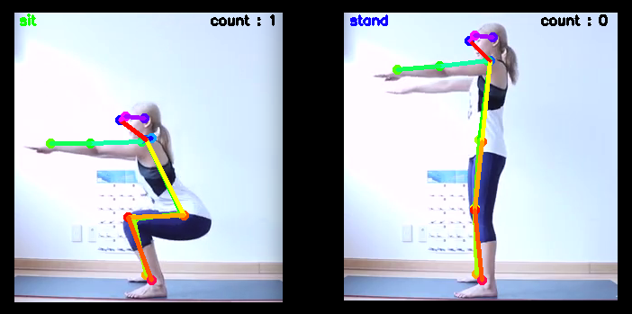

# 
 Workout-pose-analysis ‍🏋🏻

 
 

 🔆 pose estimaion을 이용한 운동 자세 분석  🔆

 
 
 

## Getting strated

### Prerequisites
**python 3.7.6**  
**ffmpeg**

    # ffmpeg 설치
    $ sudo apt install update
    $ sudo apt install ffmpeg
    # frame추출
    $ ffmpeg -ss [시작시간] -t [길이] -i [동영상이름] -r [프레임레이트] -s [출력해상도] -qscale:v 2 -f image2 [이미지이름]    

**requirements.txt**

    $ pip install -r requirements.txt

**tf-pose-estimation**

    # swig

    $ conda install swig

    $ cd tf-pose-estimation/tf_pose/pafprocess
    $ swig -python -c++ pafprocess.i && python3 setup.py build_ext --inplace

    # tf-slim

    $ pip install git+https://github.com/adrianc-a/tf-slim.git@remove_contrib

    $ cd tf-pose-estimation/models/graph/cmu
    $ bash download.sh 

 
 
 

## Gather Data
Youtube 동영상을 이용하여 data를 수집합니다.
1. yt_download.py를 실행해서 Youtube 동영상을 다운로드합니다.

       $ python yt_download.py -v [비디오id] -p [저장위치]

2. ffmpeg를 이용해서 동영상을 frame 단위로 추출합니다.

        $ ffmpeg -ss [시작시간] -t [길이] -i [동영상이름] -r [프레임레이트] -s [출력해상도] -qscale:v 2 -f image2 [이미지이름]    

 
 
 

## Data Preprocessing
추출한 frame 영상을 전처리한 후, tf-pose-estimation을 이용해서 필요한 관절 포인트를 추출해서 csv file로 저장합니다.
1. preprocessing.py를 실행해서 영상을 필요한 부분으로 crop하고 저장합니다.

        $ python preprocessing.py -f [프레임이 저장된 폴더] -s [crop하고 저장할 폴더]

        #폴더구조
       |--- train
       |    |--- squat
       |    |    |--- sit
       |    |    |    |---sit_0.png
       |    |    |    |---sit_1.png
       |    |    |    |---...
       |    |    |--- stand
       |    |         |---...
       |    |--- shoulder press
       .    .    |--- ...
       .    .    .   

2. tf-pose-estimation을 이용하여 관절 포인트를 추출하고 csv file로 저장합니다.

        $ cd tf-pose-estimation
        $ python make_dataset --image_folder [train 폴더] --dataset_path [csv file 저장위치]
        # e.g. python make_dataset --image_folder ../data/train/ --dataset_path ../dataset

 

## Train
csv file을 이용하여 모델을 train합니다.

 

## Demo
### Test Inference
run.py를 실행하여 이미지에 대해서 openpose를 적용하여 test하였습니다.
    
        $ cd tf-pose-estimation
        $ python run.py --image [image path]
        # e.g. python run.py --image ../data/test.png --model mobilenet_thin

  

### Workout Pose Estimation
workout.py를 실행하여 video를 재생하여 현재 동작을 확인하고 count 합니다.

        $ cd tf-pose-estimation
        $ python workout.py --video [video path]

 
 
 

## Reference

- tf-oepnpose : https://github.com/ildoonet/tf-pose-estimation  
- tf-oepnpose(tensorflow 2.0): https://github.com/gsethi2409/tf-pose-estimation